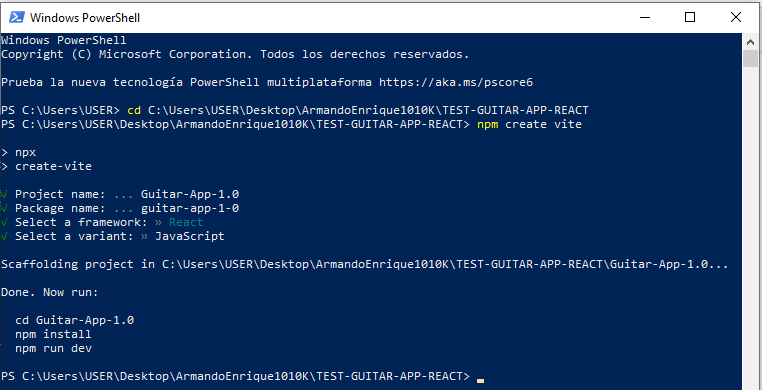

# Guia

## Comandos en consola

## Grabar los trastes de la guitarra (+100 archivos de sonido)

ANTES

01  11  21  31
02  12  22  32
03  13  23  33
04  14  24  34
05  15  25  35
06  16  26   36

PLANOS DE AHORA

10 11 12 13
20 21 22 23
30 31 32 33
40 41 42 43
50 51 52 53
60 61 62 63

## REQUERIMIENTOS DE USUARIO

- [ ] Cada vez que pulsa sobre un boton de la guitarra, que reproduzca la nota

- [ ] Al tocar una nota en la misma fila, silenciar la nota anterior, pues es el comportamiento por defecto del instrumento

- [ ] Controlar el volumen del sonido por una fila de notas (efecto de sonido amplificador)

- [ ] Alternar entre modos de cuerda:
  
  - [ ] Modo Normal:
  
  - [ ] Modo automatico: silencia la nota anterior que fue tocada en una fila diferente
  
  - [ ] Modo pulso: silencia la nota al soltar la tecla o el cursor presionado ???
  
  - [ ] 

- [ ] Un boton para silenciar todas las notas tocadas hasta el momento

- [ ] Visualizar 11 columnas de notas por defecto, esto lo podra controlar mediante un controlador

- [ ] ?????? UN CRUD PARA EL MANEJO DE CONFIGURACIONES DE LA GUITARRA 
