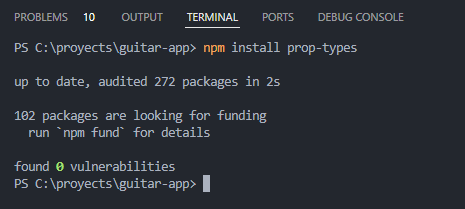

# Guia

## Comandos en consola

## Grabar los trastes de la guitarra (+100 archivos de sonido)

ANTES

01  11  21  31
02  12  22  32
03  13  23  33
04  14  24  34
05  15  25  35
06  16  26   36

PLANOS DE AHORA

10 11 12 13
20 21 22 23
30 31 32 33
40 41 42 43
50 51 52 53
60 61 62 63

## REQUERIMIENTOS DE USUARIO

- [ ] Grabar más de 100 notas de una guitarra, voy 12 notas hasta el momento

- [x] Cada vez que pulsa sobre un boton de la guitarra, que reproduzca la nota

- [x] Al tocar una nota en la misma fila, silenciar la nota anterior, pues es el comportamiento por defecto del instrumento

- [x] Controlar el volumen del sonido por una fila de notas (efecto de sonido amplificador)

- [ ] Alternar entre modos de cuerda:
  
  - [x] Modo Normal: no silencia la nota que fue tocada en una fila diferente
  
  - [ ] Modo automatico NEXT: silencia la nota ... que fue tocada en una fila diferente
  
  - [x] Modo automatico PREV: silencia la nota anterior que fue tocada en una fila diferente

- [ ] Modo auto / pulso: reproduce la nota al pulsar la tecla o lo silencia al momento de soltar la tecla.

- [ ] Un boton para silenciar todas las notas tocadas hasta el momento

- [ ] Visualizar 11 columnas de notas por defecto, esto lo podra controlar mediante un controlador

- [ ] ?????? UN CRUD PARA EL MANEJO DE CONFIGURACIONES DE LA GUITARRA 

# Comandos en powershell

## Instalación de dependencias howlerjs y tonejs

## Instalación de Prop-types

## ENLACES Y REFERENCIAS

¿Cuáles son las partes de la guitarra acústica?

https://www.txirula.com/blog/partes-guitarra-acustica.html

Manipulación del dom con una Ref

[useRef – React](https://es.react.dev/reference/react/useRef#manipulating-the-dom-with-a-ref)

EL PEOR ERROR - LA SOLUCIÓN FUE IMPLEMENTAR HOWLER JS EN LUGAR DE ENCADENAR PROMESAS EN JAVASCRIPT

[javascript - How to prevent &quot;The play() request was interrupted by a call to pause()&quot; error? - Stack Overflow](https://stackoverflow.com/questions/36803176/how-to-prevent-the-play-request-was-interrupted-by-a-call-to-pause-error)

https://tonejs.github.io/

https://libreriasjs.com/libreria-javascript-crear-musica-electronica-tonejs/

https://legacy.reactjs.org/docs/events.html#keyboard-events

[React onKeyDown Event - GeeksforGeeks](https://www.geeksforgeeks.org/react-onkeydown-event/)

## DIFICULTADES
