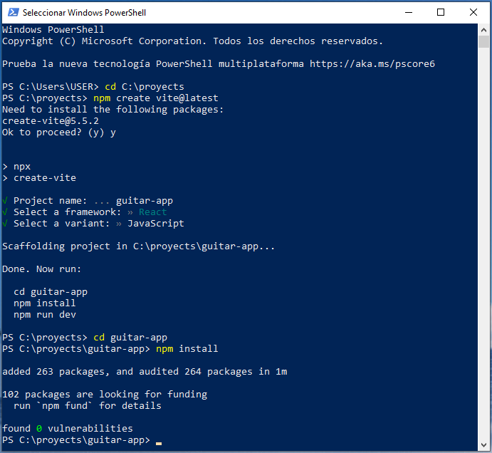
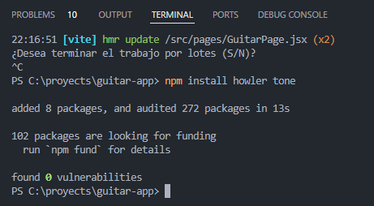
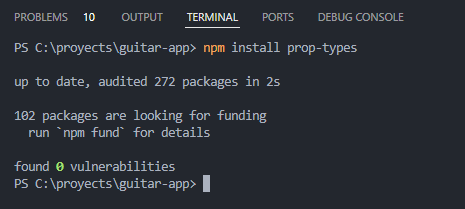

# Comandos en powershell

## Instalación de dependencias howlerjs y tonejs

## Instalación de Prop-types

## ENLACES Y REFERENCIAS

¿Cuáles son las partes de la guitarra acústica?

https://www.txirula.com/blog/partes-guitarra-acustica.html

Manipulación del dom con una Ref

[useRef – React](https://es.react.dev/reference/react/useRef#manipulating-the-dom-with-a-ref)

EL PEOR ERROR - LA SOLUCIÓN FUE IMPLEMENTAR HOWLER JS EN LUGAR DE ENCADENAR PROMESAS EN JAVASCRIPT

[javascript - How to prevent &quot;The play() request was interrupted by a call to pause()&quot; error? - Stack Overflow](https://stackoverflow.com/questions/36803176/how-to-prevent-the-play-request-was-interrupted-by-a-call-to-pause-error)

https://tonejs.github.io/

https://libreriasjs.com/libreria-javascript-crear-musica-electronica-tonejs/

## DIFICULTADES
