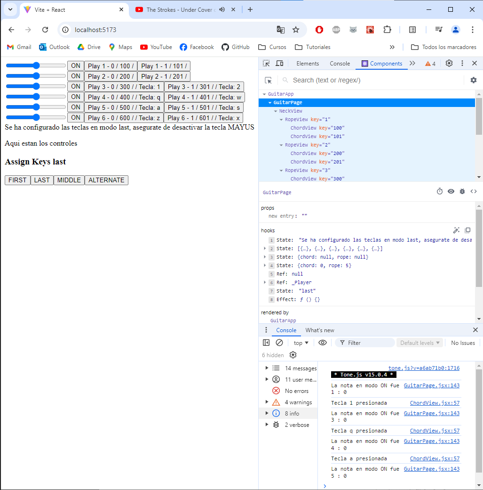
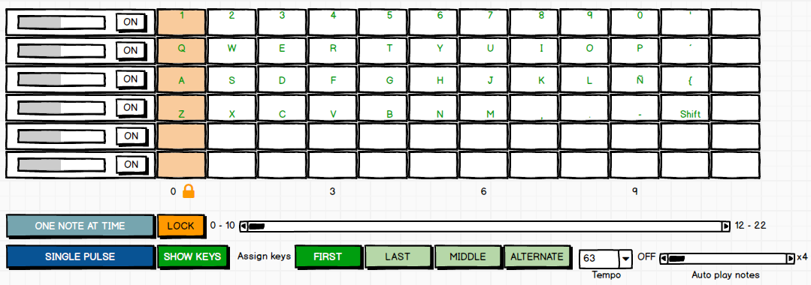

# TEST-GUITAR-APP-REACT

Aplicacion de guitarra hecho con REACT

- Me quedo con la libreria TONEJS porque ofrece varios efectos de sonido.
- Me rendi, aunque solamente ME FALTABAN 7 LINEAS DE CODIGO, tuve que usar chatgpt para investigar sobre un algoritmo dinamico que permita asignar una tecla a cada cuerda de la guitarra.
- Se puede controlar el volumen por cada una de las cuerdas de la guitarra.
- Pulsa el boton ON para desactivar la funcionalidad de reproducir una nota si la nota anterior se encontraba en una cuerda diferente.

Pendiente:

- Investigar como reproducir una nota de la guitarra pulsando una tecla del teclado.
- Aun no voy a implementarle un hook personalizado ni el contexto de React, pues falta bastante por construir

ESTE ES EL AVANCE:

DISEÑO PROPUESTO:

